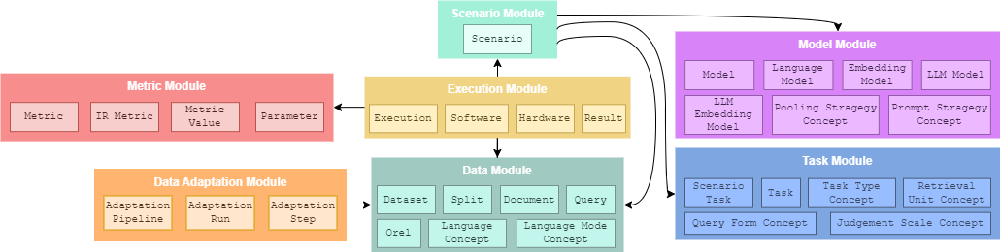

# CSIR Vocabulary — Repository Overview

A compact, modular formalization for comparative search & information retrieval.

---

## Structure (put your image here)

<!-- Replace the `src` with your diagram path (e.g., docs/structure.png) -->
<p align="center">
  
</p>

---

## Modules at a glance

- **Task** → defines the evaluation objective, relevance notion, and judgment protocol; constrains **Metric** design and guides **Adaptation** and **Scenario**.
- **Data** → describes corpora, queries, assessments, and CS annotations; input to **Adaptation** and bound (as versioned splits) in a **Scenario**.
- **Adaptation** → pipelines that construct/transform datasets/splits and queries/documents for CS; consumes **Data** under a **Task** and emits artifacts used by **Scenario**.
- **Model** → the evaluated system (encoder/LLM backbone, pooling/prompting, similarity); configured in **Scenario** and consumes (adapted) **Data**.
- **Metric** → metric families and concrete parametrizations; declared for a **Task** and applied to **Model** outputs on (adapted) **Data**.
- **Scenario** → binds a **Task** to one or more (possibly adapted) **Data** splits with a **Model** configuration and a **Metric** set; reusable, versioned experimental template.

---

## Repository layout

```
.
├── csir-task.ttl        # Task module
├── csir-data.ttl        # Data module
├── csir-adapt.ttl       # Adaptation module
├── csir-model.ttl       # Model module
├── csir-metric.ttl      # Metric module
├── csir-scenario.ttl    # Scenario module
└── README.md
```

---
